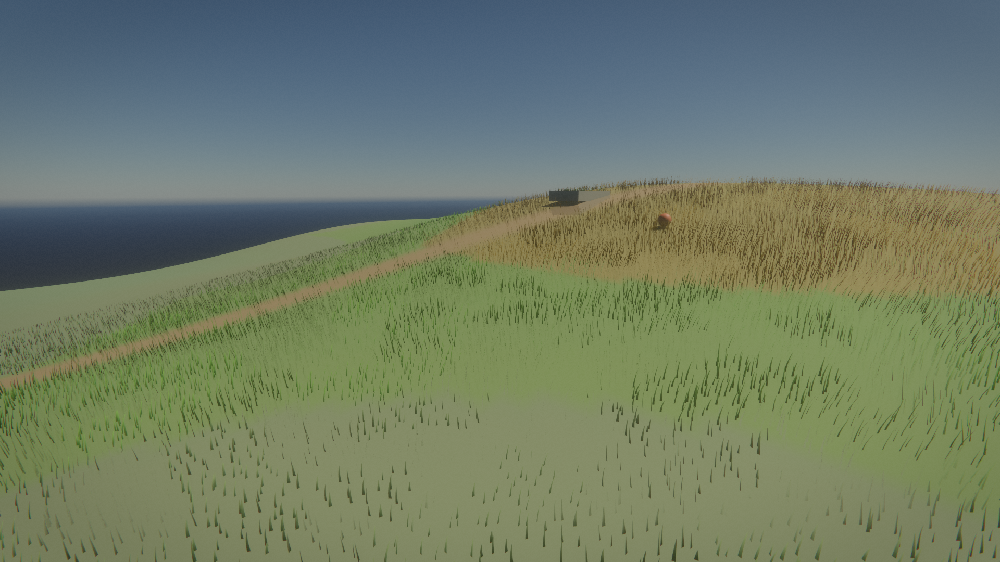
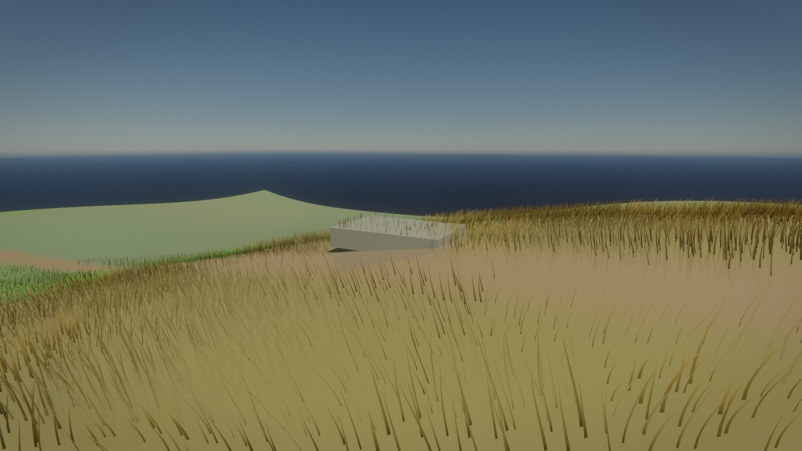
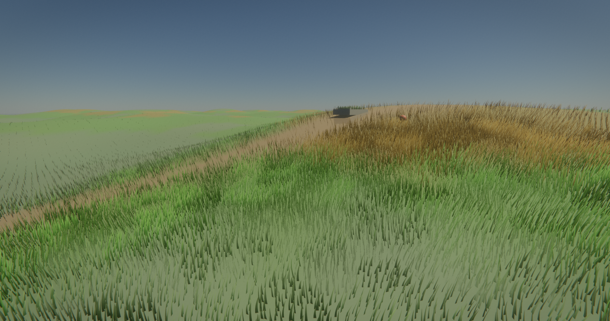

# Procedural Grass

`render::ProceduralGrass` reconstructs a deterministic blade field on the GPU
from compact semantic data. Applications describe where grass can grow, define
up to eight blade families, and submit bounded local interactions. The renderer
generates and draws only the candidates relevant to the current camera.



## Inputs

Set `FrameView::grass_domain` for each frame that should render grass. The
domain and all pointed-to arrays are non-owning and must remain valid through
`Renderer::RenderFrame`.

| Type | Purpose |
| --- | --- |
| `GrassFieldSample` | One heightfield texel: height, density, discrete type, and growth multiplier |
| `GrassType` | Blade color, dimensions, curve shape, material response, wind response, and clump scale |
| `GrassSurfaceTriangle` | A growable authored-mesh triangle with a stable ID, density, growth, and type |
| `GrassInteraction` | A height-aware persistent bend footprint, either radial or projected from a horizontal direction |
| `GrassGenerationSettings` | Independent candidate spacing, streaming, density LOD, geometry LOD, fade, slope, and capacity controls |

The heightfield is optional when the domain contains surface triangles. This
supports overlapping or non-heightfield geometry such as rocks, roofs, and
placed soil meshes without changing the terrain representation.

```cpp
render::GrassDomain grass;
grass.samples = field.data();
grass.sample_width = field_width;
grass.sample_height = field_height;
grass.origin_x = world_origin.x;
grass.origin_z = world_origin.z;
grass.extent_x = world_extent.x;
grass.extent_z = world_extent.z;
grass.types = types.data();
grass.type_count = static_cast<u32>(types.size());
grass.surfaces = growable_triangles.data();
grass.surface_count = static_cast<u32>(growable_triangles.size());
grass.sample_revision = terrain_revision;
grass.type_revision = grass_type_revision;
grass.surface_revision = growable_surface_revision;

view.grass_domain = &grass;
view.grass_interactions.push_back(interaction);
```

## Pipeline

1. `Prepare` sanitizes controls and uploads changed semantic inputs into the
   current frame slot. Nonzero per-stream revisions reuse unchanged field,
   type, and surface uploads; revision zero keeps that input volatile.
2. The compute pass resets counters, evaluates nested camera-centered lattices
   at strides 1, 2, and 4 plus mesh-surface candidates, and rejects roots by
   density, slope, distance, and a conservative point-frustum test. A nonzero
   `far_radius` appends up to three distant rings at strides 8, 16, and 32
   whose radius doubles with their stride, carrying the field out to
   kilometres for a near-constant candidate cost per ring. Overlapping
   refinement bands fade between lattice strides without duplicate roots.
   Terrain height and analytic normal reconstruction use four field reads per
   root.
3. Current interactions stamp a camera-following 512 by 512 bend history. The
   bounded ping-pong field recenters in world space and retains tracks without
   retaining an unbounded event list. Accepted roots sample current and previous
   bend once, preserving deformation motion vectors.
4. Each workgroup compacts accepted roots locally before reserving space in a
   fixed-capacity instance arena. Stable cell and surface IDs seed all jitter,
   dimensions, orientation, tint, and Voronoi clump behavior. Surface records
   are located with a bounded binary search.
5. Near instances grow upward from the front of the shared arena, far
   instances grow downward from its back, and distant instances fill a third
   arena region with its own budget. Three indexed indirect draws expand them
   into seven-, three-, and one-segment cubic-Bezier ribbons whose segments
   share row vertices, so a blade costs `(segments + 1) * 2` vertex
   invocations. Distant blades widen with their lattice stride, and a
   screen-space clamp keeps every ribbon at roughly a pixel or wider so far
   fields do not dissolve into sub-pixel raster noise.
6. Grass participates in the reversed-Z depth/motion prepass and the opaque
   scene pass. Wind deformation is evaluated at current and previous times to
   produce motion vectors.

Height, density, and growth interpolate continuously. Type IDs remain discrete:
stochastic interpolation softens boundaries without creating invalid blended
families. Density reduction, curve complexity, and distance fade are separate
controls so content can tune them independently.

## Controls

| Setting | Effect |
| --- | --- |
| `candidate_spacing` | World-space root spacing before semantic density rejection |
| `stream_tile_size`, `stream_radius` | Camera snapping and active generation radius |
| `far_radius` | Distant one-segment rings past the stream radius, up to 8x the stream radius and 4 km; zero disables |
| `density_lod_start/end`, `far_density` | Gradual distant candidate thinning |
| `geometry_lod_start/end` | Transition range between seven- and three-segment blades |
| `fade_start/end` | Blade height fade before the stream boundary |
| `max_slope_cos` | Minimum accepted surface-normal Y component |
| `bend_recovery_time` | Retained-track half-life in seconds; zero keeps tracks indefinitely |
| `max_blades` | Per-frame compacted blade limit |

`SanitizeGrassSettings` clamps unsafe values and preserves ordered LOD ranges.
The renderer feature switch is `RenderSettings::procedural_grass`; it can also
be set in a render preset as `procedural_grass` or overridden with
`RX_PROCEDURAL_GRASS`.

## Growable Meshes



Split growable mesh regions into `GrassSurfaceTriangle` records. Winding
defines the growth normal, area determines the candidate count, and
`surface_id` plus the local candidate index gives each root stable randomness.
Keep IDs stable while an object is loaded to avoid visible reshuffling.

## Persistent Bending


Submit one `GrassInteraction` per character, wheel, plow, or other moving
footprint that should disturb grass. `position_radius.xyz` is the world-space
center, `position_radius.w` is the footprint radius, and
`direction_strength.xz` should follow the object's horizontal velocity or
travel direction. Its `w` component controls bend magnitude. A zero direction
creates a radial footprint. The source height and radius gate the history when
blades sample it, preventing a ground footprint from bending a sufficiently
separated roof or growable surface at the same XZ position.

```cpp
render::GrassInteraction footprint;
footprint.position_radius[0] = object_position.x;
footprint.position_radius[1] = object_position.y;
footprint.position_radius[2] = object_position.z;
footprint.position_radius[3] = 0.65f;
footprint.direction_strength[0] = object_velocity.x;
footprint.direction_strength[1] = 0.0f;
footprint.direction_strength[2] = object_velocity.z;
footprint.direction_strength[3] = 1.0f;
view.grass_interactions.push_back(footprint);
```

The default five-minute value is a half-life rather than a hard reset; tracks
remain visible while gradually relaxing. History uses fixed 512 by 512
ping-pong fields for bend vectors, premultiplied height/radius metadata, and
explicit layer confidence, staying bounded at 10 MiB regardless of session
length. It persists while the affected world position remains inside the
camera-following field; areas shifted outside that field are discarded rather
than consuming more memory. Changing the domain seed or backing sample/surface
arrays starts a new history.

One vertical layer is retained per field texel. If footprints on widely
separated stacked surfaces overlap in XZ, the strongest current footprint owns
that texel; this bounded policy avoids allocating per-object or per-surface
history. Height metadata is camera-relative and premultiplied with an explicit
confidence channel. Field records use point sampling so incompatible neighboring
height layers never interpolate through a nonexistent midpoint, and competing
layers switch as complete records. Half-life decay accounts for elapsed time
even when the grass domain was temporarily absent.

## Limits

- Heightfields are capped at 256 by 256 samples.
- A domain accepts up to eight blade types, 2,048 surface triangles, and 16
  interactions.
- Each terrain LOD ring (three detailed plus up to three distant) is capped at
  1,048,576 candidates. With a heightfield, mesh surfaces receive a separate
  262,144-candidate budget; surface-only domains can use 1,048,576 candidates.
  Generation workgroups stop sampling once the 262,144-blade near/far arena
  (or the separate 131,072-blade distant arena) is full.
- GPU arenas are allocated lazily on the first valid grass domain.
- Persistent bend history uses six fixed 512 by 512 half-float images (10 MiB)
  and follows the active grass stream extent.
- Vulkan grass pipelines require at least 224 bytes of push-constant storage;
  the optional feature disables cleanly on adapters below that limit.
- Surface candidate lookup takes at most 12 binary-search probes.
- Grass currently receives direct sun and ambient lighting but does not cast or
  sample the renderer's shadow systems.
- Grass is raster-only and is not included in path-traced frames.

## Demo

```sh
vkrun ./build/linux/runtime/rx --demo grass --no-rt
```

The scene combines a semantic rolling heightfield, three blade families,
stochastic family boundaries, a winding density-masked path, grass on a
standalone stone mesh, gusting wind, and a moving local interaction marker.
`RX_GRASS_SPACING` overrides candidate spacing for density stress tests,
`RX_GRASS_MAX_BLADES` overrides the compacted blade cap, and `RX_GRASS_FAR`
sets the distant-ring radius (0 restores the classic stream-bounded field).
The demo field spans two kilometres so the distant tier reads as unbroken
grassland to the horizon.



## Layout

- `engine/render/geometry/procedural_grass.{h,cc}`: public data model, resource
  ownership, compute scheduling, and indirect draws.
- `engine/render/shaders/geometry/procedural_grass*`: candidate generation,
  shared ABI, curve expansion, prepass, and scene shading.
- `runtime/demo_grass.{h,cc}`: the `--demo grass` semantic field and growable
  surface example.

## Testing

- `procedural_grass_test`: settings sanitation, candidate-area calculations,
  and rejection of degenerate or non-finite surface triangles.
- `settings_ini_test`: feature-toggle serialization, parsing, round-trip, and
  partial-preset behavior.
