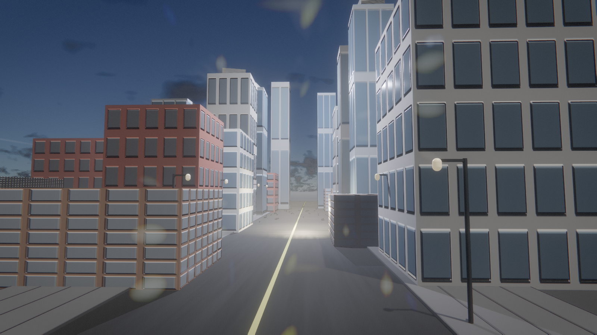
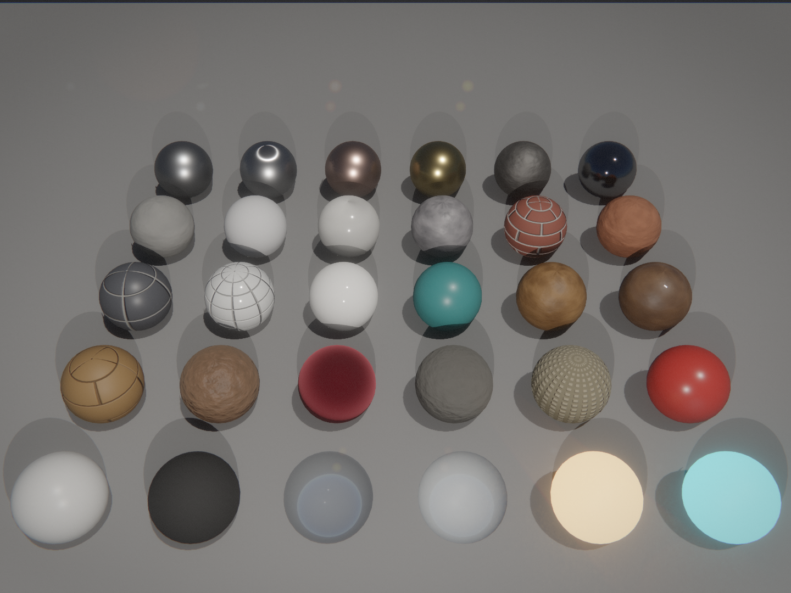

# rx - render experience

A standalone real-time rendering engine, extracted from the
[recreation](https://github.com/Force67/recreation) project. rx is the part of
that engine that has nothing to do with Bethesda games: the Vulkan/D3D12
renderer, the asset pipeline, ECS, physics, animation and audio, plus a small
viewer runtime in place of the game.

## What's here

- **engine/render** - the renderer, behind a backend-agnostic RHI
  (`engine/render/rhi/`: vulkan, d3d12-via-vkd3d, null). HLSL and
  [Slang](docs/SLANG.md) shaders compiled to SPIR-V at build time (dxc /
  slangc). Feature set includes: TAA / MSAA /
  FSR3 / DLSS upscaling + FSR3 frame generation, hardware ray tracing (RT
  shadows/AO/reflections, DDGI, RCGI radiance-cache GI, ReSTIR DI), a
  reference path tracer, NRD
  denoising, screen-space SSS, strand hair, virtual textures, virtual geometry
  (cluster-DAG LOD, gpu-driven two-pass hi-z occlusion culling, 64-bit
  visibility buffer with compute + mesh-shader rasterization, instancing),
  froxel volumetrics, procedural grass ([design](PROCEDURAL_GRASS.md)), local
  shadow atlas, clustered + baked texture-space decals
  ([design](DECALS.md)), lit
  translucency, FFT ocean, gaussian splats, GPU particles, HDR10 output,
  dynamic resolution, texture streaming, async compute, VRS, meshlet path.
- **engine/asset** - glTF loading (cgltf) including morph targets and weight
  animations, OpenUSD stage loading ([tinyusdz](https://github.com/lighttransport/tinyusdz):
  `.usd`/`.usda`/`.usdc`/`.usdz` with composition, GeomSubsets and
  UsdPreviewSurface; see [USD.md](docs/USD.md)),
  MaterialX, primitives, LOD simplification, Loop subdivision,
  virtual filesystem with `.rxp` archives (rx ships its own under
  `engine/assets`, mounted at boot: `fonts://` holds the default UI font).
- **engine/core** - SDL3 windowing (+ KDE HDR monitor), job system, input
  action layer with gamepad support, math, logging, feature registry.
- **engine/ecs / scene / physics (Jolt) / anim / audio / rpc** - entity
  storage and scheduling, scene components, Jolt-backed rigid bodies and
  arbitrary-mesh cloth (native XPBD/skinning/pressure plus fast self-collision;
  see `engine/physics/README.md`), pose and locomotion helpers including
  configurable [procedural walk styles](docs/WALK_STYLES.md), extensible
  [body dynamics and soft-tissue deformation](docs/BODY_DYNAMICS.md), a facial
  expression controller (damped per-region
  transitions between named morph poses, plus a blink/micro-motion life
  layer), an SDL mixer with wav/xwma decoding, and a small RPC value/registry
  layer. **engine/combat** adds the shooter half of a first-person game -
  weapon definitions as data, fire modes, spread bloom, view recoil, reloading,
  aim-down-sights, hitscan with falloff and penetration, ballistic projectiles,
  explosions and health/armor/teams
  ([design](engine/combat/README.md), [range demo](docs/SHOOTER.md)).
  Skeletal animation sampling comes from
  [kinema](https://github.com/Force67/kinema), a reusable SoA animation
  runtime consumed as a sibling checkout.
- **engine/app** - the composition root a game embeds instead of forking the
  viewer: `app::Host` owns the subsystems and the fixed-step/render loop and
  drives a game-implemented `app::Application`. See [EMBEDDING.md](EMBEDDING.md)
  for using rx as the engine of your own game.
- **runtime/** - the `rx` viewer (the reference `app::Application`):
  `--gltf <scene>`, `--usd <stage>` or `--demo <id>` (water,
  materials, cornell, cloth, grass, lod, oit, fire, bricks, sss, strands, vt, vgeo, lights,
  meshlet, occlusion, imposters, gaussian, fur, gpuparticles, autolod, mtlx,
  gym, shooter),
  fly camera, imgui debug overlay (F1), physics cube toss (F), camera
  record/replay/orbit/showcase drivers (`RX_RECORD` / `RX_REPLAY` / `RX_ORBIT`
  / `RX_SHOWCASE`), frame capture (`RX_UI_SHOT`).
- **apps/editor** - the scene editor. It opens `.rxscene`, `.gltf`, `.glb`,
  `.usd`/`.usda`/`.usdc`/`.usdz` and `.blend` documents. Blend files are converted by Blender in background mode
  into a cached GLB, retaining visible meshes, deform bones, skin weights, and
  body-deformation morphs. Compatible chest-helper/Genesis rigs automatically
  get a live jiggle preview plus selectable Hip Sway and March walk profiles.

## Global illumination

Indirect diffuse comes from one of three tiers, all fully dynamic (rx bakes
nothing - no lightmaps, no probe bakes, no per-level GI data on disk):

- **SSGI** - screen-space bounce; the raster fallback when ray query is
  unavailable.
- **DDGI** (default) - a single camera-following probe volume, traced and
  blended every frame. Simple and cheap, but range-limited (its whole volume
  is ~24 m) and it only bounces sun + emissive.
- **RCGI** (`RX_RCGI=1`, experimental) - a cascaded radiance-cache pipeline
  modeled on the GI id Software shipped in idTech 8: a world-space cascaded
  light grid lights ray hits outside the frustum, hits land in a spatially
  hashed world radiance cache that is shaded incrementally (sun + emissive +
  clustered lights + previous-frame bounce), cascaded octahedral irradiance
  volumes (~256 m range, one cascade updated per frame) integrate the cache,
  and a half-res 1-ray/pixel final gather resolves per-pixel GI through a
  three-level cache fallback (previous frame's screen radiance, then the
  radiance cache, then the volumes) into 2-band SH, which a bilateral
  denoise + temporal upscale turn into the indirect-diffuse term. The why:
  DDGI's every-probe-every-frame update cannot scale its volume up, while
  RCGI's amortized caches keep a flat ~0.2 ms world-side cost regardless of
  range, add point/spot-light bounce, and the gather restores the per-pixel
  contact detail probe interpolation loses - for roughly +1 ms over DDGI.
  Design, GPU interfaces and measured costs: [RCGI.md](RCGI.md).

Both probe modes need ray query; the path tracer modes (`RX_PATHTRACE*`)
remain the ground-truth reference.

## Vehicles

Three vehicle simulators sit over the Jolt physics world: cars and motorcycles
(Jolt's wheeled/motorcycle controllers with a manual gearbox, torque curve, and
a surface-material grip table driving rain wetness and tyre aquaplaning), and
force-based boats (volumetric buoyancy, planing, prop ventilation) and aircraft
(strip-theory wings with stall, MTOM-honest performance, raycast landing gear).
Each feeds a procedural audio stack that synthesizes the engine, skid and wind
from telemetry - no samples. The `--demo drive` scene shows all three over a
painted material heightfield with a lake. See [docs/VEHICLES.md](docs/VEHICLES.md).

## Building

```sh
git submodule update --init          # third_party/equilibrium
git clone https://github.com/Force67/kinema ../kinema   # animation runtime (sibling)
tools/get_jolt.sh                    # physics (optional but recommended)
tools/get_fidelityfx.sh              # FSR3 (optional)
tools/get_nrd.sh                     # NRD denoiser (optional)
tools/get_dlss.sh                    # DLSS (optional, NVIDIA)
cmake --preset linux
cmake --build build/linux
build/linux/runtime/rx --demo cornell
```

Requirements: CMake 3.24+, a C++23 compiler, dxc (DirectXShaderCompiler),
slangc (shader-slang, for the `.slang` shaders — see docs/SLANG.md),
SDL3. Vulkan headers/volk/VMA are pinned and fetched by CMake. On NixOS just
use the dev shell: `nix develop`, which also provides `vkrun` (host NVIDIA
driver bridging) and `swrun` (headless lavapipe + Xvfb software path).

For a small headless body-jiggle sample, configure with
`-DRX_BUILD_EXAMPLES=ON` and run `build/linux/examples/body_jiggle_example`.

To open an authoring scene directly in the editor, build with
`-DRX_BUILD_EDITOR=ON` and run:

```sh
build/linux/apps/editor/rx_editor character.blend
```

Blender must be available on `PATH`. The first open performs a background
conversion; subsequent opens use `$XDG_CACHE_HOME/rx/blend` (or
`~/.cache/rx/blend` on Linux) until the source or converter changes.

```sh
tools/get_sponza.sh
build/linux/runtime/rx --gltf assets/sponza/Sponza.gltf
```

### Text scenes and headless capture

A `.rxscene` is a text scene that composes shapes, surfaces, lights, a camera and
real art assets. [docs/AUTHORING.md](docs/AUTHORING.md) is the guide to writing
one; `runtime/scenes/city.rxscene` is a demo city built entirely this way, with
no imported art, from the building prefabs in `runtime/scenes/prefabs/city/`.




- `Shape.kind` is `box | sphere | plane | cylinder | cone | torus | capsule`.
- `Model.path` names a `.gltf`/`.glb` file, which renders with the materials and
  textures it ships with. The whole file is placed as one child entity per
  instance its nodes describe, so the authored `Transform` moves the lot;
  `"file.glb#mesh2"` places just that one mesh at the entity's own `Transform`.
  Skinning, animation and the file's own lights and cameras are not applied.
- `Surface` carries the pbr lobes the mesh shaders actually shade (clearcoat,
  anisotropy, ior, sheen, subsurface, iridescence, transmission, specular
  colour/strength, `env_reflect` and the soft/rim/back light fills), plus six
  image maps (base colour, normal, roughness, metallic, occlusion, emissive)
  that put a downloaded PBR texture set on a primitive, or names a `.mtlx`
  document to take the whole material from - constants and image-node inputs
  alike, so an ambientCG-style document works as it ships.
- `Pattern` generates a procedural texture at load (`checker | grid | brick |
  gradient | noise`) and binds it to base colour, plus a normal map derived from
  the same pattern read as a height field and a roughness map ramped across it.
  So a scene with no image files still gets textured, relief-bearing surfaces.

`runtime/scenes/showcase.rxscene` exercises all of it in one frame;
`runtime/scenes/model.rxscene` places glTF files next to a procedural shape;
`runtime/scenes/cornell.rxscene` is the minimal example.

`--dump-schema` prints every component and prop such a file may use, generated
from the reflection registry, so it never goes stale. Loading a `.rxscene` is
strict: an unknown component, prop, shape kind, pattern kind, `.mtlx` path or
model reference fails the load with a message naming it, rather than silently
substituting a default. So does a number the loader cannot read whole (`1 abc 3`, `0.6f`) or
cannot hold (`nan`, `inf`, `1e40`), and a `Transform.rotation` that is not a
unit quaternion, `0 0 0` included: the rotation matrix is built without a
normalize, so a short or non-unit quaternion scales the mesh, and the zero one
collapses it. A rejected load creates no entities. Saving refuses a non-finite
float for the same reason: there is no literal for it that reads back.

`--shot` renders windowless (no compositor, no display needed) and exits nonzero
if the png was not written, which is what makes the author-render-look loop
scriptable:

```sh
build/linux/runtime/rx --dump-schema
build/linux/runtime/rx --scene runtime/scenes/showcase.rxscene \
    --headless --shot /tmp/shot.png --shot-frames 20 --width 1280 --height 720
```

A capture run drives the clock in lockstep at 1/60 s instead of the wall clock,
so the frame it writes is decided by the frame index and not by how loaded the
machine was: two runs of the same build land 25x closer together, which is the
difference between a comparison that catches a regression and one that drowns in
its own noise (see `rxdiff` below). It is automatic because forgetting it does
not fail, it just quietly widens the noise. `RX_FIXED_DT=<seconds>` picks a
different delta and `RX_FIXED_DT=0` asks for wall-clock timing back.

Under `swrun` add `--no-rt` or `--preset low`: lavapipe's acceleration-structure
builds crash, independently of this path.

### The material palette

Guessing 22 pbr floats and checking by screenshot is slow and fails quietly, so
`runtime/scenes/materials/` is a library of 30 named materials whose values are
known to read correctly. A preset is an ordinary `.rxscene` carrying nothing but
a `Surface` (and a `Pattern` where the material needs a texture), so referencing
one is the prefab instancing that already exists:

```
entity
Name.value = "Crate"
Shape.kind = "box"
Shape.size = 0.5 0.5 0.5
Prefab.path = "materials/wood_planks.rxscene"
```

The preset's components land on the entity, and anything the entity says itself
wins, per component: an instance that authors any `Surface` field owns the whole
`Surface`, so a variant is a copy of the preset with one line changed rather than
a partial override. A preset is a prefab like any other, which also means an
entity that already instances a prefab of its own cannot take one: the material
has to be written out, or folded into that prefab.

`--dump-materials` lists the palette as json - the name, the path to write into
`Prefab.path`, the file's leading comment, and the props each preset sets -
generated by loading every file, so it can neither go stale nor list a preset
that does not load:

```sh
build/linux/runtime/rx --dump-materials
build/linux/runtime/rx --dump-materials path/to/your/own/palette
```

`runtime/scenes/material_sheet.rxscene` renders the whole palette as one grid of
spheres, one cell per preset, so a pass over the batch costs one render instead
of 30. The checked-in result is the browsable reference; cells read left to
right, back row to front, and each cell's `Name.value` in the scene file is its
label (`A1 steel` .. `E6 emissive cyan`).



| row | contents |
| --- | --- |
| A | steel, brushed aluminium, copper, gold, cast iron, chrome |
| B | concrete, plaster white, marble white, granite, brick red, terracotta |
| C | slate tile, tile ceramic, porcelain white, ceramic glazed teal, wood oak, wood walnut varnished |
| D | wood planks, leather brown, velvet crimson, wool felt, linen canvas, plastic red |
| E | plastic white, rubber black, glass clear, glass frosted, emissive warm, emissive cyan |

Smooth metal (roughness below `reflection_roughness_cutoff`, 0.6) takes its
environment from the traced reflection rather than the prefiltered probe, and
that trace currently comes back dark and warm outdoors, so chrome and gold read
darker here than the same values do with `--no-rt`. The values are the measured
ones either way; the checked-in sheet is the default path, which is what an
author will see.

### Checking a scene and a render without looking at them

`--validate` loads a `.rxscene` and reports what is structurally wrong with it,
with no device and no window (0.01 s per scene, so it fits on every edit and in
CI). A strict load rejects, and stops at the first bad line; this explains, and
walks the whole file, so a scene the loader refused still comes back as one
report instead of twenty edit-and-rerun cycles (it retries leniently when the
strict load says no, and carries that refusal as a finding of its own). It
covers what a load cannot: the combinations the engine's own walks quietly skip.
A `Renderable` with no `Transform` (the frame walk is `Each<Transform,
Renderable>`, so it uploads and then never draws), a `Light` or `Camera` the
viewer drops the same way, a degenerate scale, rotation, `Shape.size` axis or
fov, a light that cannot contribute, duplicate guids, a dangling or circular
`Parent`, and a number literal that is unreadable or non-finite, which is
visible only in the text once the loader has read 0 from it. Nonzero exit on any
error-level finding; `--json` for a machine-readable report.

A file that can draw nothing on its own - no `Shape`, `Model`, `Renderable`,
`Light` or `Camera` anywhere in it - is a fragment rather than a scene: a
material preset is exactly that, and it is only ever rendered merged onto an
instance. The two checks that would otherwise fire on all 30 of them, "`Surface`
on an entity with no `Shape`" and "no geometry in the scene", are true of the
file and false of every instance of it, so they are skipped there. A scene that
merely forgot its geometry still carries the camera or the light it was going to
render with, so it is not a fragment and still gets both.

`rxdiff` compares two captures. Under the locked capture clock a software or
non-raytraced run is bit identical run to run, but the raytraced one is not
quite: the radiance cache claims its hash slots in whatever order the gpu waves
land in, which moves a few pixels by a least significant bit or two. So
comparing hashes is still not a check to rely on. It reports an rmse and the
fraction of pixels whose worst channel moved past `--hot-delta`, with a bounding
box and an optional amplified diff image, and fails past a tolerance measured
against that residual rather than guessed: across 78 pairs of same-build
captures over four scenes, five resolutions, four frame counts and both
renderers the worst rmse was 0.000433, and the default sits at 0.002. That is
tight enough to fail a single Cornell wall going from 0.8 to 0.7 albedo (0.00689,
which the pre-lockstep gate passed) and still 4.6x clear of the noise.
`tools/rxdiff.cc` carries the measurement and what it costs in sensitivity.

```sh
build/linux/runtime/rx --validate runtime/scenes/showcase.rxscene --json
build/linux/rxdiff baseline.png /tmp/shot.png --diff /tmp/diff.png
```

### Driving a running engine

`--authoring-endpoint <socket>` serves the engine's script commands
(`engine/scene/scene_handlers.cc`) on a local unix socket while it runs, so a
scene can be changed without a restart. `--dump-commands` prints the signatures,
generated from the same registry the endpoint dispatches into. `rxcall` issues
one call and prints the reply:

```sh
build/linux/runtime/rx --dump-commands
build/linux/runtime/rx --scene runtime/scenes/cornell.rxscene --headless \
    --authoring-endpoint /tmp/rx.sock &
build/linux/rxcall /tmp/rx.sock World.Spawn crate 1 0.5 2 1   # -> 9
build/linux/rxcall /tmp/rx.sock World.Teleport 9 -1.25 0.75 0.5
build/linux/rxcall /tmp/rx.sock World.GetPosition 9           # -> -1.25 0.75 0.5
```

An entity id is one integer (index in the low 32 bits, generation in the high
32) and a vec3 is three numbers, which is why a signature's parameter count and
its `wire_args` differ.

The endpoint is off unless the flag is passed, and reaching it is equivalent to
owning the running scene: the socket is 0600, only a connection from this user's
own uid is served, and the commands are not registered on the networked rpc path
at all. `engine/authoring/command_bridge.h` has the threat model.

## Notes

- The C++ namespace is `rx::`; env-var knobs are `RX_*` (`RX_PATHTRACE=1`,
  `RX_DRS=1`, `RX_MSAA=4`, `RX_HDR_OUTPUT=pq`). Grep for `base::Option` to see
  the full set.
- `engine/render/presets/` holds editable .ini quality presets, loadable live
  from the debug overlay.
- `-DRX_SANITIZE=ON` builds with ASan+UBSan, `-DRX_SANITIZE_THREAD=ON` with
  TSan (mutually exclusive). Run TSan builds under `swrun`, not `vkrun`: the
  NVIDIA driver segfaults inside ThreadSanitizer, lavapipe does not.
- History predating the extraction lives in the recreation repository.
