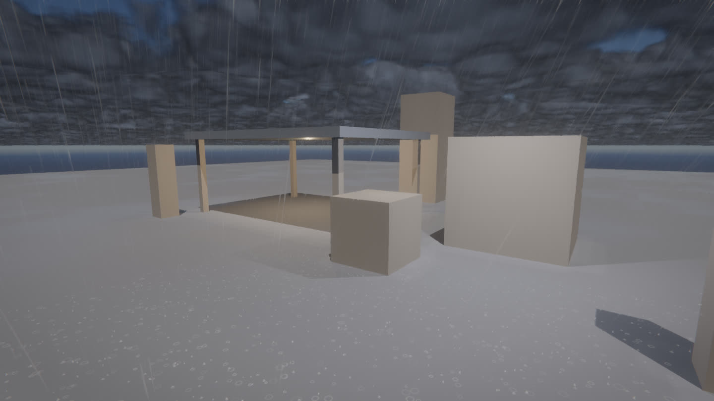
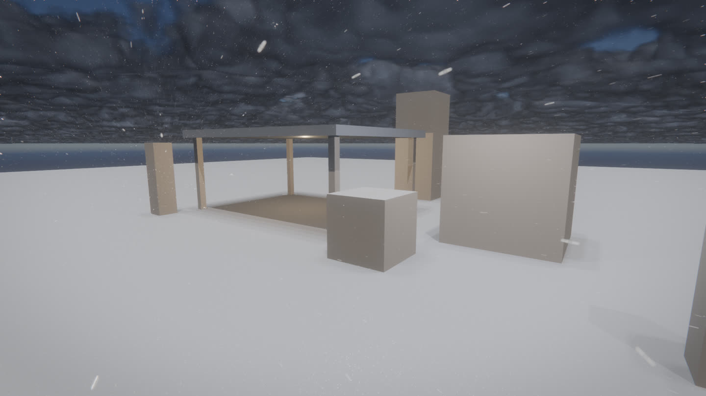
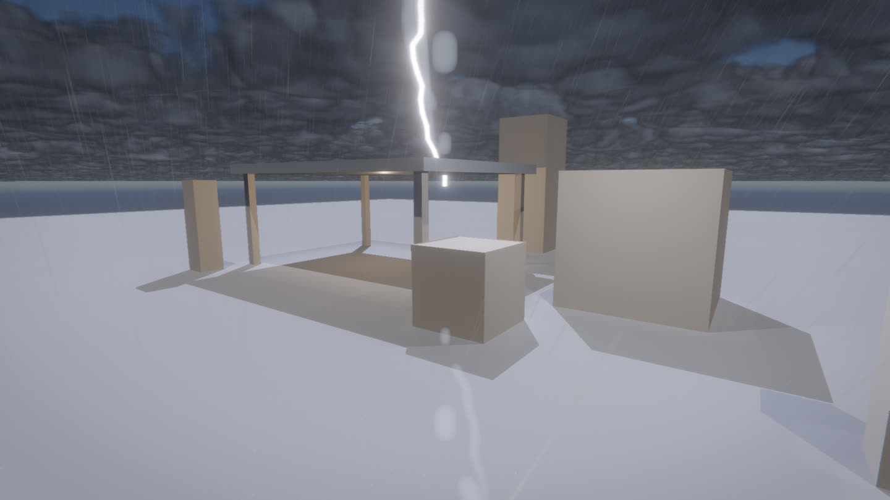
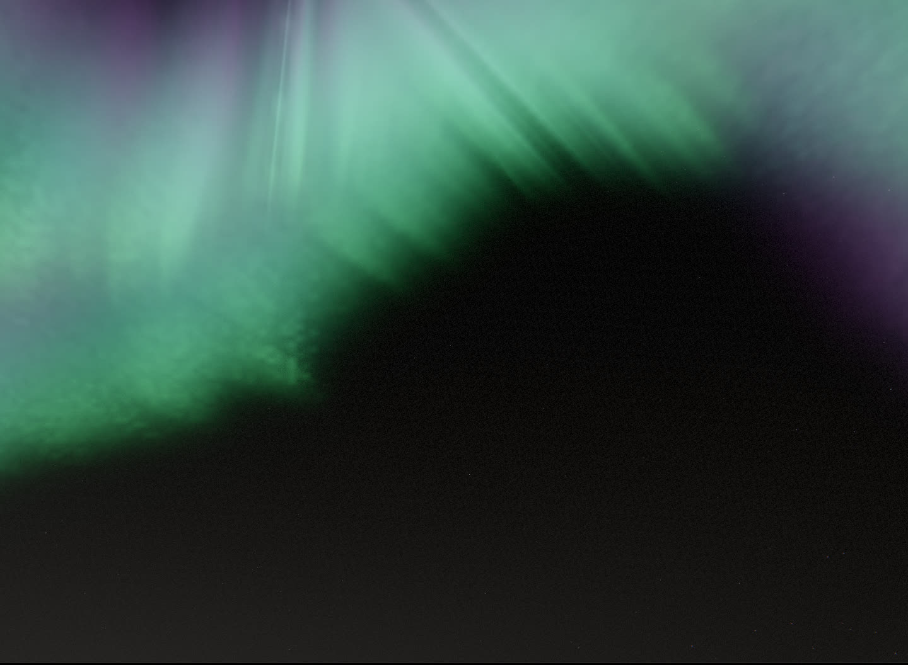
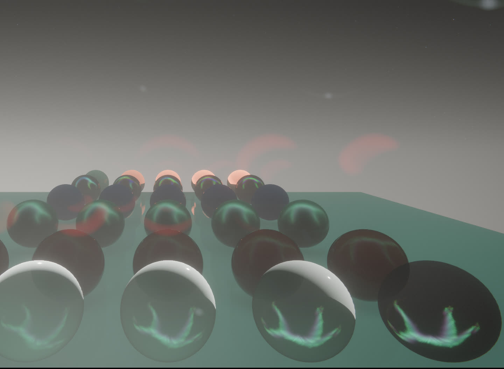

# Weather

High-end weather rendering: volumetric precipitation with sky occlusion,
surface wetness / snow cover, procedural lightning, storm wind, and a
raymarched aurora that lights the night scene through the IBL. Everything is
driven through one value struct the application writes per frame:
`render::WeatherSettings` (`settings().weather`).

## The state

| Field | Meaning |
| --- | --- |
| `precipitation`, `snow` | live intensity 0..1 and rain/snow selector |
| `volumetric` | 3D particle precipitation (off = legacy screen-space streaks) |
| `wind_yaw`, `wind_speed`, `gustiness` | shared wind: cloud drift + shadow, rain slant, snow drift |
| `wetness`, `snow_cover` | surface response, integrated by the game (soak/dry, blanket/melt); live precipitation acts as a floor |
| `lightning` | global flash 0..1 (sun/ambient/cloud boost), driven by the game's strike envelope |
| `strike_pos/_age/_seed/_energy` | the active strike: procedural bolt + positioned flash light; `strike_age < 0` = none |
| `rt_shadows` | ray-query sun shadowing per particle (needs ray query; free fallback otherwise) |
| `aurora`, `aurora_intensity` | night-sky curtains, also baked into the sky cubemap → IBL |

`RenderSettings::night` (0 day..1 night, from `SkyLighting::night`) tells the
sky how dark it is: games hand the light over to a downward moon at night, so
stars/moon/aurora cannot be inferred from the sun direction alone.

## The passes

- **PrecipOcclusion** (`atmosphere/precip_occlusion.*`): 512² top-down depth
  map around the camera answering "can this point see the sky". Gates
  particles (no rain under bridges), splash heights (roofs splash) and
  wetness/snow accumulation (dry strips under cover). Re-rendered only when
  the camera crosses an 8 m cell or every 16 frames.
- **PrecipVolume** (`atmosphere/precip_volume.*`): stateless GPU particles —
  position is a pure function of (instance id, time, weather), no sim
  buffers. Up to 131k velocity-stretched rain streaks / 98k tumbling snow
  flakes in a world-anchored wrap volume, plus 24k procedural splashes
  (ripple ring + crown) at the occlusion map's height. Lit by sun/moon with a
  forward-scatter lobe, dimmed by the froxel volume, TAA-jittered with exact
  motion vectors. With ray query, each particle traces one sun ray
  (`rt_shadows`): rain sheets darken in shadowed streets and sparkle in gaps.
- **SurfaceWeather** (`atmosphere/surface_weather.*`): wetness darkening +
  sky-reflection sheen with a world-anchored puddle mask and rain-rate ripple
  rings; snow cover with view-dependent glints. Both channels independent
  (slush works), both gated by sky visibility.
- **LightningSystem** (`atmosphere/lightning.*`): stateless midpoint-displaced
  bolt (128 main + 5×24 branch segments from the strike seed) as additive HDR
  ribbons, plus one clustered point light at the channel that the froxel
  volumetrics, reflections and wet ground pick up automatically. The CPU/GPU
  mirrored envelope gives the ~80 ms main stroke and deterministic re-strokes.
- **Aurora** (`shaders/atmosphere/aurora.hlsli`): 22-step raymarch through a
  95–260 km shell — three fbm-warped curtain systems, striation rays, green →
  purple emission ladder. Rendered crisp in `sky.ps` and baked into the sky
  cubemap (`sky.cs`), so an active aurora tints irradiance and reflections;
  the cubemap refreshes on a 0.4 s cadence only while the aurora is up.

## Env knobs

`RX_PRECIP` `RX_SNOW` `RX_WIND` `RX_WIND_DIR` `RX_WETNESS` `RX_SNOW_COVER`
`RX_LIGHTNING` `RX_AURORA` `RX_AURORA_INTENSITY` `RX_CLOUD_COVERAGE`
`RX_STRIKE_TEST=<meters>` (deterministic strike in front of the camera).

## Demo

`rx --demo weather`: ground lot, columns and an open shelter (the occlusion
showcase), storm defaults, random strikes while it rains. All knobs above
apply; `RX_GAME_HOUR=0` for night.

Cost on a 1080p frame (NVIDIA GB10): ~0.3–0.7 ms for heavy volumetric rain
with splashes; the bolt pass is noise-level during a strike.

## Screenshots

| | |
| --- | --- |
|  |  |
| storm rain, splashes, wet sheen, dry zone under the shelter | volumetric snowfall with settled cover |
|  |  |
| a strike frame: branched bolt, cloud flash, lit rain | raymarched aurora curtains |

*the aurora lights the world: green IBL on the ground, curtains in every reflection*
