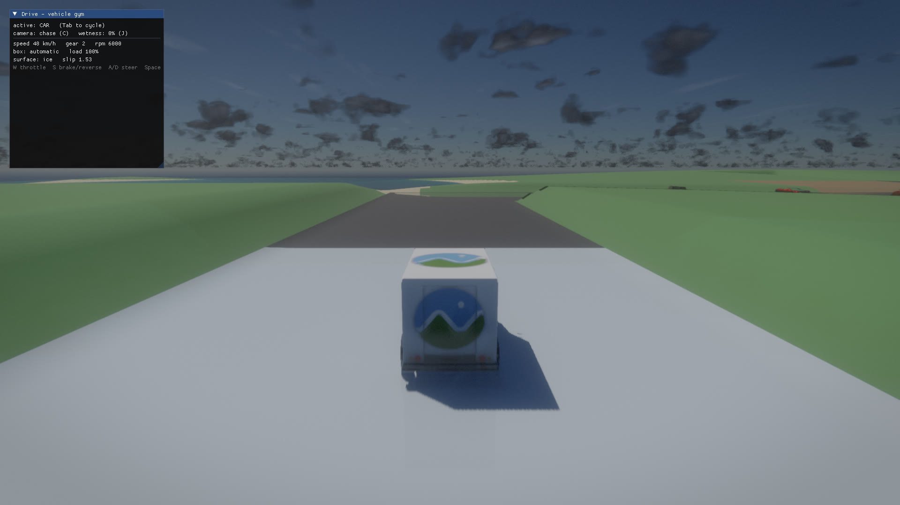
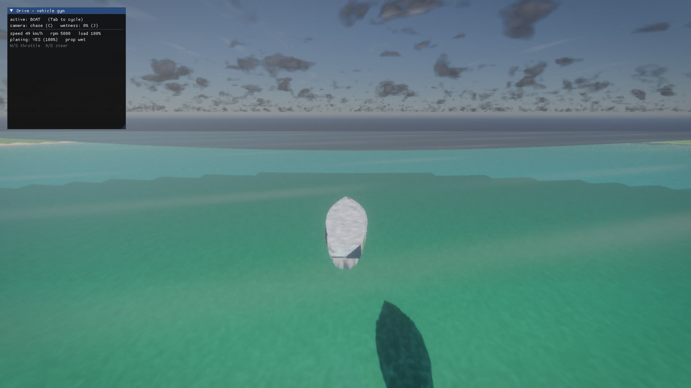
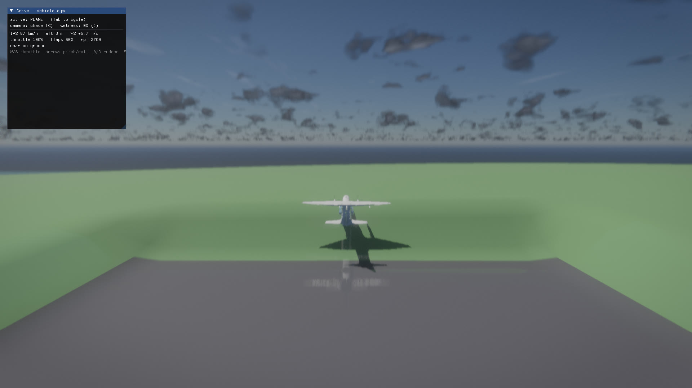

# Vehicles

Three vehicle simulators layered over the public `rx::physics::PhysicsWorld`
(Jolt) force API, plus a procedural audio stack that renders each engine from
telemetry. Nothing here is bespoke Jolt code: the boat and aircraft integrate
their own hydro/aero models on top of `AddForce` / `AddForceAtPoint` /
`AddTorque` / `SampleWater`, and the car is Jolt's `WheeledVehicleController`
with a surface-aware tyre-friction combine bolted on. Gravity, integration and
contact response stay in Jolt.

Shared `PhysicsWorld` primitives the simulators lean on: a global
`set_wind(Vec3)` / `wind()` (uniform airmass velocity, m/s world space, default
still air) the aero models sample; a `Raycast(origin, dir, max, out, ignore)`
overload that skips one body, so a suspension ray cast from a hardpoint *inside*
a body's own collision shape does not hit itself (`ignore == 0` skips nothing);
and `SetBodyInertia(id, diagonal_kgm2)` to replace a dynamic body's
collision-shape-derived inertia tensor with an explicit body-space diagonal.

- **Cars / motorcycles** — `PhysicsWorld::CreateVehicle` /
  `CreateMotorcycle` (`engine/physics/physics_world.{h,cc}`).
- **Boats** — `rx::physics::Boat` (`engine/physics/boat.h`).
- **Aircraft** — `rx::physics::Aircraft` (`engine/physics/aircraft.h`).
- **Audio** — `rx::audio` engine/skid/wind synthesis and the `VehicleAudio`
  driver (`engine/audio/{engine_synth,synth_voice,aux_synth,vehicle_audio}.h`).

All SI units (metres, kg, seconds, newtons, radians), engine convention: **+Z
forward, +Y up, right-handed**, so the RIGHT side is −X.

## Update-ordering contract

The force-based simulators (boat, aircraft) only *stage* forces on their body;
Jolt clears accumulated forces after it integrates. So each fixed step:

```
for each vehicle:  vehicle.Update(input, dt)   // stage this step's forces
world.Update(dt)                               // Jolt integrates once
```

`vehicle.Update` **must** run before `PhysicsWorld::Update`, with the same `dt`,
which must be the world's fixed step (~1/60 s). Telemetry (`state()`) is
refreshed from the body pose sampled at the *start* of the step. The Jolt car is
driven the mirror way: `DriveVehicle(...)` then `world.Update(dt)`. Cross-system
proof that all three coexist in one world: `test/vehicle_integration_test.cc`.

---

## Cars & motorcycles

Jolt `VehicleConstraint` + `WheeledVehicleController` (cars) or
`MotorcycleController` (bikes). A dynamic chassis box on four (or two)
suspension-raycast wheels with an automatic or manual gearbox. Wheel order:
cars `FL FR RL RR` (front steer, rear handbrake), bikes `front rear`. There is
no wheel geometry in the physics world — wheels are suspension raycasts; the
caller renders chassis/wheels from `GetVehicleTransform` / `GetVehicleWheel`.

The racing-sim fields on `VehicleDesc` all default to "keep the legacy arcade
tune" (`0` or `-1` = the previous hardcoded/Jolt default), so existing consumers
are unchanged.

### `VehicleDesc` (drivetrain highlights)

| Field | Meaning |
| --- | --- |
| `drivetrain` | `kRWD` / `kFWD` / `kAWD`; `awd_front_split` sets the front torque fraction |
| `gear_count`, `gear_ratios[8]`, `final_drive` | manual box; `0` keeps Jolt's 5-speed |
| `max_rpm`, `min_rpm` | `max_rpm` doubles as the hard rev limiter |
| `shift_up_rpm`, `shift_down_rpm` | automatic shift points (`0` = 4000 / 2000) |
| `engine_inertia` | flywheel kg·m² (reflects as ratio²·inertia through the box) |
| `clutch_strength` | clutch coupling (`0` = legacy 10) |
| `engine_braking` | off-throttle engine angular damping (trailing-throttle decel) |
| `torque_curve[8]`, `torque_curve_count` | normalized (rpm-frac, torque-frac) curve; `0` = Jolt's stock 0.8/1.0/0.8 |
| `tire_long_friction`, `tire_lat_friction` | scale the tyre slip-curve peaks (`~1.5` = slicks) |
| `downforce` | `F = downforce · v²` at the CoM along −Y |
| `traction_control` | cuts throttle past ~8% driven-wheel slip |

`MotorcycleDesc` adds a lean spring (`lean_spring` / `lean_damping` /
`max_lean_angle`) and a speed-aware steer limit so the bike banks into corners
without toppling; handbrake input is ignored.

### Manual box

`SetManualTransmission(id, true)` switches to the `VehicleInput` overload:
`shift_up` / `shift_down` are edges (a rising edge changes one gear), and the
`clutch` input (`0..1`, `1` = fully disengaged) is honoured. In automatic mode
the box works the clutch itself and the shift edges are ignored.

### Telemetry — `VehicleState`

`rpm`, `gear` (Jolt convention: `-1` reverse, `0` neutral, `1..N`),
`forward_speed` (signed m/s), `engine_load` (`0..1` = delivered/available
torque), `engine_torque` (Nm), `is_shifting` (clutch slipping through a change),
and per-wheel `WheelState`: `contact`, `suspension_length`,
`suspension_compression` (`0..1`), `longitudinal_slip` (`0` traction .. `1`
locked/spinning), `angular_velocity`, `rotation_angle`, `surface`, `submerged`,
`wading_depth`.

### Surface material system

Static colliders carry a `SurfaceType` tag; the tyre-friction combine looks it
up per wheel contact. Untagged geometry defaults to `kAsphalt` (full grip, the
legacy feel).

| API | Effect |
| --- | --- |
| `AddStaticBox/Mesh/Shape/HeightField(..., SurfaceType)` | tag a whole collider |
| `AddHeightField(..., material_indices, palette, palette_count)` | per-quad materials: `(samples-1)²` indices into a palette, so one cell carries an asphalt road over grass |
| `AddStaticMeshInstance(..., SurfaceType)` | shared shape, surface recorded per body and resolved at contact |

Instead of Jolt's default `sqrt(tyre, body)` combine, the callback scales the
tyre's own longitudinal/lateral grip by the surface's table entry × rain wetness
× per-wheel aquaplaning. Grip table (`physics_world.cc`, a documented tune, not
measured — `longitudinal` / `lateral` scale the tyre peak, `1` = dry asphalt;
`wet` is the multiplier at full rain, lerped from `1` dry):

| Surface | long | lat | wet |
| --- | --- | --- | --- |
| asphalt  | 1.00 | 1.00 | 0.70 |
| concrete | 0.98 | 0.98 | 0.75 |
| dirt     | 0.75 | 0.72 | 0.55 |
| gravel   | 0.80 | 0.75 | 0.70 |
| grass    | 0.65 | 0.60 | 0.55 |
| sand     | 0.55 | 0.50 | 0.60 |
| snow     | 0.45 | 0.40 | 0.80 |
| ice      | 0.15 | 0.12 | 0.70 |
| mud      | 0.45 | 0.40 | 0.85 |
| wood     | 0.85 | 0.82 | 0.65 |
| metal    | 0.70 | 0.65 | 0.55 |

### Wetness & aquaplaning

`set_surface_wetness(0..1)` is global rain: it lerps every surface's grip toward
its `wet` value (wet asphalt ~0.7 of dry; loose dirt turns mud-like). Off (`0`)
by default.

Aquaplaning is per-wheel and needs standing water (the `set_water_height`
callback returning true at the contact). Grip fades as the contact patch floods
and speed builds a water wedge the tread can't clear:
`grip ·= 1 − 0.9 · depth_frac · speed_frac`, where a patch is "fully awash" at
half the wheel radius of water, onset is ~8 m/s and full hydroplaning ~25 m/s.
Below onset or on a dry patch it is a no-op.

---

## Boats

`rx::physics::Boat` — a force-based motorboat over one dynamic hull body. The
constructor spawns the hull and **exempts it from the world's generic
buoyancy** (`set_buoyancy_exempt`) so only the hull model's forces act; the two
schemes never stack. `BoatInput` is `throttle` (`-1..1`), `steer` (`-1..1`),
`trim` (`-1..1`).

Force models (`BoatDesc`):

| Model | Summary |
| --- | --- |
| Volumetric buoyancy grid | `grid_beam × grid_height × grid_len` samples fill the hull box; each displaces its share while submerged, so the centre of buoyancy shifts to the low side on heel (righting) and aft on bow-lift (pitch stability) — true metacentric behaviour, one `SampleWater` call per sample. `grid_height ≥ 2` self-rights a knock-down. |
| Ballast keel (`com_drop`) | effective CoM below the geometric centre, emulated as a gravity righting couple (`τ = r_ballast × m·g`) since Jolt keeps the real CoM at the box centre |
| Hull drag | quadratic, wetted-fraction scaled, taken relative to water flow: `drag_fwd` (streamlined bow) / `drag_aft` (blunt transom) / `drag_lateral` (keel carves) / `drag_vertical` (heave) |
| Planing | past `hull_speed` the bow lifts and longitudinal drag drops by `plane_drag_reduction`, so a planing hull tops out faster; `plane_lift` capped at `plane_lift_cap × weight` |
| Propeller | `max_thrust` vs a spooling `rpm` (`spool_time` lag), applied at `prop_offset` **only while that point is submerged** — launch off a wave and the screw loses bite; `reverse_fraction` astern |
| Rudder | stern side force `= steer · (rudder_speed_gain · v_fwd² + rudder_wash_gain · |thrust|)`, so prop wash gives steering authority at a standstill; `yaw_damping` settles turns |
| River flow | all drag/thrust is relative to the `SampleWater` flow, so a current carries the hull |
| Wind | the world `wind()` pushes on the exposed (above-water) topsides: force quadratic in the wind speed *relative to the hull*, scaled by the exposed `1 − submerged` fraction and a directional blend of the box side/bow areas, applied above the waterline so a strong beam wind shoves a drifting hull downwind and heels it slightly; conservative `wind_drag` coefficient |

### Telemetry — `BoatState`

`rpm`, `engine_load` (`0..1`, spool-limited thrust fraction), `throttle`,
`speed_mps`, `forward_speed` (signed, hull axis), `planing` (`0..1`), `wetted`
(`0..1` submerged-sample fraction), `prop_submerged`, `position`, `rotation`.

---

## Aircraft

`rx::physics::Aircraft` — a force-based fixed-wing plane over one dynamic
fuselage body. Each step integrates a strip-theory aero model, a prop or jet,
and three-wheel landing gear. Air density is a constant 1.225 kg/m³ (ISA sea
level). Defaults describe a Cessna-172-class light single. `AircraftInput`:
`throttle` `0..1`, `pitch` / `roll` / `yaw` `-1..1` (command axes, not
deflection angles), `flaps` `0..1` (quantized to `flap_steps`), `brakes` `0..1`.

### Aero model (`AircraftDesc`)

- **Wing** split into two equal halves (independent stall, so a wing drop is
  possible): lift-curve slope `wing_cl_alpha` to `wing_stall_alpha_rad`, then a
  `post_stall_decay` blend into the flat-plate curve. Induced drag
  `CL²/(π·AR·oswald_efficiency)`, parasitic `cd0`. `flap_delta_cl/cd` add lift
  and drag.
- **Ailerons** — `aileron_authority` differential ΔCL between the halves.
- **Horizontal tail / elevator** — `tail_area_m2` at `tail_arm_m` aft,
  `elevator_authority` ΔCL at full stick.
- **Vertical fin / rudder** — side force vs sideslip (`fin_cl_beta`) plus
  `rudder_authority`; `fuselage_side_cd/area` weathervane damping.
- **Inertia tensor** — the constructor overrides Jolt's collision-box inertia
  (the slim fuselage box excludes the wings, so its roll inertia is several
  times too small) with an honest tensor from the airframe geometry, using
  published single-engine-GA radii of gyration: `I_roll = m·(0.22·b/2)²`,
  `I_pitch = m·(0.34·L/2)²` (`L ≈ 1.8·tail_arm`), `I_yaw ≈ 0.85·(I_roll +
  I_pitch)`. So roll/pitch/yaw response is real, not box-derived.
- **Rotational aero damping** (`roll_damp` / `pitch_damp` / `yaw_damp`) — a
  light safety net over the strip-theory surface damping that keeps post-stall
  tumbling bounded. Now that the inertia is honest, `roll_damp` is reduced (the
  ~6× larger roll inertia plus the wings' own roll damping carry it); `pitch` /
  `yaw` stay as a light net over the strong tail/fin.
- **Propulsion** — prop: momentum-theory thrust falling off with airspeed,
  `T ≈ min(power·eff / max(V, v_min), static_cap)`, `rpm` spool-lagged. Jet:
  static thrust scaled by throttle through a spool lag, telemetry `rpm` = N1 %.

### Mass / MTOM semantics

`empty_mass_kg` + `payload_kg` (fixed at creation). Payload is clamped so
`empty + payload ≤ structural_mass_limit_kg` (a hard cap slightly above MTOM). A
plane loaded between `max_takeoff_mass_kg` (MTOM) and that limit **is created and
flies, but flies like a pig** — long ground roll, weak or no climb — purely from
the induced-drag/weight coupling in the model, not a scripted penalty.
`over_mtom()` reports the between-MTOM-and-limit state.

### Landing gear

Three legs (`0` nose/steerable, `1` left main, `2` right main). Each is a
downward suspension **raycast** from `local_pos` plus a wheel: spring/damper
along the contact normal over `travel`, `brake_force` on braked wheels,
`rolling_resistance`, and a `lateral_grip` (µ) cap on side force.
`nose_steer_angle_rad` is full low-speed nose-wheel deflection. `local_pos` is
the **real hardpoint** at/inside the fuselage box (belly `y = −0.5`); the
suspension ray casts with **self-exclusion** (`Raycast(..., body)`) so it
clears the plane's own underside instead of the old below-the-box workaround.

### Telemetry — `AircraftState`

`airspeed_mps`, `vertical_speed_mps`, `alpha_deg`, `beta_deg`, `stalled_left` /
`stalled_right`, `rpm` (prop rpm or N1 %), `engine_load` (`0..1`), `throttle`,
`on_ground`, `gear_compression[3]` (`0` extended .. `1` bottomed),
`total_mass_kg`, `over_mtom`, `position`, `rotation`. Airspeed and every aero
force are taken **relative to the airmass** — the world's global `wind()` plus
the aircraft's own `set_wind(Vec3)` local bias added on top (both default to
still air) — so a headwind shortens the ground roll and a crosswind weathervanes
the nose.

---

## Audio

Procedural, headless-capable, NaN-free and bounded. The DSP is float, render-
thread-only; parameter hand-off is the `SynthVoice`'s job.

- **`EngineSynth`** (`engine_synth.h`) — a four-stroke (or turbine) model: a
  bank of harmonics + half-order subharmonics of the firing frequency, gains
  shaped by load, overrun burble, intake/exhaust noise, and an optional prop or
  turbine layer. Driven by a pure-data `EnginePreset` (cylinders, unevenness,
  idle/redline rpm, partials, brightness, exhaust low-pass, intake level, prop
  blades/gearing, or a turbine whine sweep).
- **`SkidSynth` / `WindSynth`** (`aux_synth.h`) — band-passed noise the slip
  ratio gates (silent on a rolling tyre), and speed-driven wind rush.
- **`SynthVoice`** (`synth_voice.h`) — the procedural `Decoder` seam: renders a
  `Synth` endlessly at the mixer rate. `SetParams` (engine thread) hands over a
  `SynthParams` snapshot lock-free via a seqlock; per-sub-block one-pole
  smoothing keeps updates click-free.
- **`VehicleAudio`** (`vehicle_audio.h`) — the one class a game needs per
  vehicle: owns the engine/skid/wind voices, and `Update(VehicleAudioState)`
  publishes parameters, places the positional voices and ducks when submerged.

### The six presets

| Preset | Character |
| --- | --- |
| `InlineFourCarPreset` | buzzy, even, wide rev range |
| `V8Preset` | cross-plane rumble, uneven-fire emphasis |
| `MotorcycleTwinPreset` | high redline, hard uneven-fire pulse |
| `InboardBoatPreset` | low rpm, water-muffled exhaust (low exhaust low-pass) |
| `SinglePropPlanePreset` | engine drone + propeller blade tone |
| `LightJetPreset` | turbine whine + exhaust roar (rpm = N1 %) |

### Telemetry mapping

Two structs bridge physics to DSP. `VehicleAudioState` is the game-facing input
to `VehicleAudio`; `SynthParams` is what actually reaches the oscillators.
Values are clamped on use, so a rough estimate is fine. Per vehicle kind:

| Source | → SynthParams / VehicleAudioState |
| --- | --- |
| Car `VehicleState` | `rpm←rpm`, `load←engine_load`, `throttle←input`, `speed←forward_speed`, `slip←max wheel longitudinal_slip` (or `wheel_slip[]` per wheel), `gear`/`is_shifting` for the flare |
| Boat `BoatState` | `rpm←rpm`, `load←engine_load`, `throttle←throttle` (signed, magnitude used), `speed←speed_mps`, `submerged←!prop_submerged` |
| Aircraft `AircraftState` | `rpm←rpm` (prop rpm or N1 %), `load←engine_load`, `throttle←throttle`, `speed←airspeed_mps`; jets may add `thrust` (roar) split from `rpm` (spool) |

#### `VehicleAudioState` contract

Fields below the original block are additive and each defaults to a value that
reproduces the previous behaviour exactly, so a caller filling only the base
fields is unchanged.

| Field | Type | Default | Meaning |
| --- | --- | --- | --- |
| `rpm` | `f32` | `0` | crank rpm (turbine preset: N1 %, `0..100`) |
| `load` | `f32` | `0` | `0..1` engine load (torque demand met) |
| `throttle` | `f32` | `0` | driver throttle, **`-1..1`** (boats run astern); the **magnitude** is used |
| `speed_mps` | `f32` | `0` | ground speed, m/s |
| `slip` | `f32` | `0` | `0..1` aggregate tyre slip (fallback when no per-wheel data) |
| `submerged` | `bool` | `false` | underwater: ducks the engine gain **and** muffles the synth (`SynthParams.muffle`) |
| `position` | `Vec3` | `{}` | world position (Y-up, m) for panning |
| `wheel_slip[4]` | `f32[4]` | `{0,0,0,0}` | optional per-wheel slip, order **FL FR RL RR** |
| `wheel_count` | `u32` | `0` | `0` = ignore `wheel_slip`, use `slip`; `≥1` = intensity from the worst wheel; `≥4` = also pan the skid to the slipping side and shade its band by axle |
| `gear` | `i32` | `INT_MIN` | current gear; `INT_MIN` = unknown → **no** shift flare ever |
| `is_shifting` | `bool` | `false` | a gear change is in progress; its rising edge (with a known `gear`) fires one brief click-free flare — upshift cut if the gear rose, downshift blip if it fell |
| `thrust` | `f32` | `-1` | turbine roar level `0..1` decoupled from spool; `<0` = derive from `rpm`/N1 as before |

`SynthParams` gains matching additive fields consumed by the synths directly:
`muffle` (`0`, `0..1` output low-pass tighten + level duck), `thrust` (`-1`
sentinel = derive), `gear_shift` (`0`; `<0` upshift cut, `>0` downshift blip,
edge-triggered and passed unsmoothed so the `EngineSynth` owns the
sample-accurate envelope) and `skid_bias` (`0`, `-1` rear .. `+1` front, shades
the `SkidSynth` band). All are smoothed by `SynthVoice` except `gear_shift`.

`test/vehicle_audio_test.cc` drives the synths and the mixer path headless;
`test/vehicle_integration_test.cc` renders all three engines straight from live
telemetry inside the physics loop.

---

## The demo (`--demo drive`)





A graybox showcase of all three simulators and the surface system in one scene.

**Scene** — a ~400 × 400 m heightfield, grass by default, with:

- a painted **asphalt road loop**;
- a **300 × 20 m runway** for the aircraft;
- an **ice patch**, and **dirt** + **sand** regions (material showcase);
- a **lake** quadrant carrying the boat on the Gerstner water field.

**Models** — pulled by `tools/get_vehicles.sh` into `assets/vehicles/`:
`CesiumMilkTruck` drives, `Cesium_Air` flies, and `ToyCar` / `CarConcept` /
`GroundVehicle` are parked as a material showcase. A graybox fallback stands in
when the assets are absent.

### Controls

| Input | Action |
| --- | --- |
| **Tab** | Cycle the active vehicle |
| **W / S** | Throttle / brake-reverse (car + boat) or throttle up / down (plane) |
| **A / D** | Steer (car) or rudder (boat / plane) |
| **Arrows** | Plane pitch / roll |
| **Space** | Handbrake (car) / wheel brakes (plane) |
| **M** | Toggle manual gearbox |
| **Shift / Ctrl** | Shift up / down |
| **F** | Flaps 0 / 0.5 / 1 |
| **J** | Cycle rain wetness 0 / 0.5 / 1 |
| **R** | Reset the active vehicle |
| **C** | Chase / free camera |

### Headless captures

`RX_DRIVE_VEHICLE=car|boat|plane` picks the initially active vehicle and
`RX_DRIVE_AUTO=1` holds full throttle on it (takeoff flaps + a rotate/ease
elevator schedule for the plane), so screenshot/CI runs show motion without
input. Combine with `RX_HIDE_DEBUG_UI=1` and the usual `RX_UI_SHOT` /
`RX_UI_SHOT_FRAMES` to take the shots above.

---

## Known gaps / future work

- **Wind is a uniform global, not a spatial field** — `PhysicsWorld::wind()` is
  one world-space airmass velocity the aero simulators sample; there is no
  per-position gust/shear field yet. Cars deliberately ignore wind (negligible
  at this fidelity).
- **Audio telemetry wishlist** — *closed.* Per-wheel slip (skid intensity from
  the worst wheel, a lateral pan toward the slipping side and a front/rear band
  shade), gear/shift flags (a brief click-free shift flare) and a jet
  spool-vs-thrust split all reach the synths now; a dynamic output muffle also
  drives the submerged/occluded voice through the synth itself. All are additive
  and default-inert (see the `VehicleAudioState` table). Still open: clutch-slip
  fidelity (the flare is a fixed ~180 ms envelope, not clutch-modulated) and
  body-yaw-accurate skid panning (the lateral bias is applied in world X, exact
  only for an unrotated body — a caller can pre-rotate `position`).
