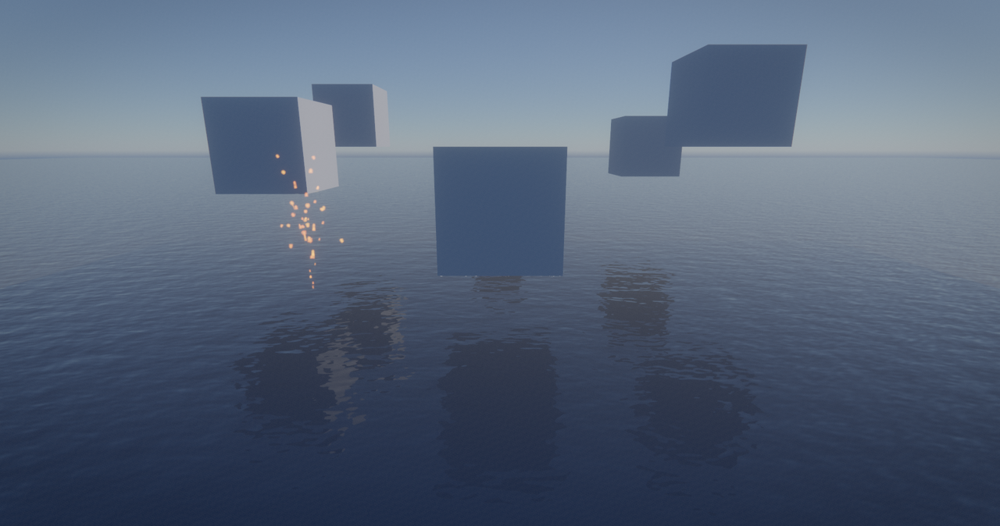

# Adaptive water geometry integration plan

## Goal

Replace the dense, uniformly subdivided ocean sheet with a persistent GPU-owned
triangle hierarchy. Compute shaders decide where to split and merge; rasterization
consumes the resulting vertex and indirect-command buffers without CPU readback.
Authored rivers, waterfalls, and irregular water volumes remain on the existing
mesh path.

## Renderer integration

1. `WaterPass` owns an `AdaptiveWaterMesh` alongside the existing water shading
   and opaque-copy pipelines. The new object owns the hierarchy, generated
   vertices, indirect commands, counters, and compute pipelines for its lifetime.
2. During transparent-draw collection, the renderer selects the largest planar
   water mesh as the ocean candidate. Its local XZ bounds and transform define
   the two root triangles. All other water draws keep their uploaded geometry.
3. Before transparent rasterization, compute updates the persistent hierarchy.
   It applies a screen-space edge target, camera distance, wave-crest complexity,
   split/merge hysteresis, and the current triangle budget. Only topology changes
   mark vertex/command slots dirty.
4. A final compute pass compacts active leaves into a budget-sized indirect
   stream. The regular water vertex/pixel shaders shade the persistent generated
   `asset::Vertex` slots through one counted indirect draw. Vulkan and D3D12 use
   their existing indirect-count RHI paths.

## Concurrent binary tree representation

- Two implicit binary heaps represent the square's root triangles. A 32-bit node
  word records leaf/split/dirty state. Heap indices encode the subdivision path,
  so triangle corners are reconstructed in compute without storing per-node
  positions.
- One thread owns each active leaf. Splits atomically reserve two children and
  retire the parent. A single sibling owner performs merges, preventing duplicate
  allocation. The active-leaf counter makes the geometry budget GPU-enforced.
- Split and merge thresholds differ, which prevents camera jitter from causing
  topology flicker. The buffers and hierarchy survive between frames.
- Generated dyadic edges receive a conservative sub-pixel expansion. It closes
  precision pinholes and T-junction gaps where a refined edge meets a coarser
  neighbor without introducing skirts or discontinuous wave samples.

## Quality and rollout

- Add `adaptive_water`, `water_triangle_budget`, and
  `water_target_triangle_pixels` settings. Presets scale the budget by platform
  tier; setting `adaptive_water = false` or `RX_ADAPTIVE_WATER=0` restores the
  uploaded mesh exactly for A/B captures.
- Allocation failure, unsupported indirect drawing, a non-planar candidate, or a
  candidate change falls back to the existing water draw for that frame.
- Expose active triangle count and capacity to the debug UI after the rendering
  path is stable; no synchronous readback is added to frame rendering.

## Validation

- Compile every new HLSL shader to SPIR-V and DXIL through the existing shader
  build.
- Unit-test CPU-side candidate classification, budget sanitization, and hierarchy
  sizing.
- Run the null-backend renderer tests and an offscreen Vulkan water-demo smoke
  test where a driver is available.
- Manually verify near/far distribution, crest refinement, temporal hysteresis,
  mixed-LOD seams, preset budgets, and legacy fallback in `--demo water`.
