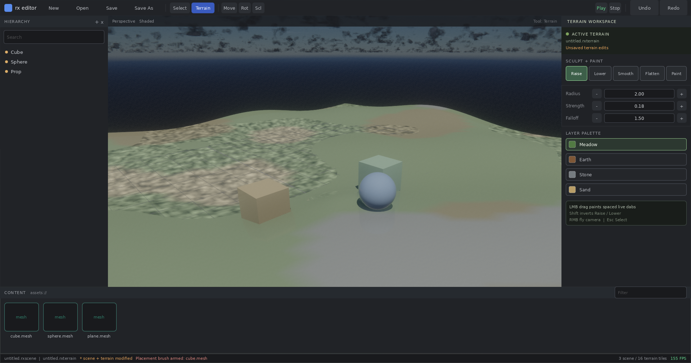

# Terrain

`rx::terrain` owns the generic sparse heightfield asset used by games and
editor tooling. It depends on `core`, `asset`, and `scene`, but not rendering,
physics, ECS, or an application. Callers that need collision can consume the
tile height spans or `SampleHeight` without introducing a physics dependency.

## Coordinates and Tiles

`TerrainDesc::origin` anchors grid sample `(0, 0)`. Tile `(x, z)` starts at
`origin.xz + (x, z) * tile_quads * sample_spacing`; signed keys are kept in
lexicographic `(x, z)` order. Heights are relative to `origin.y`, while
`SampleHeight`, flatten targets, ray hits, and streaming bounds use world y.

Each sparse tile owns `(tile_quads + 1)^2` row-major float heights and RGBA8
weights. Weights represent up to four palette layers, always sum to 255, and
default to `{255, 0, 0, 0}`. Neighboring tiles duplicate their border samples.
`AddOrReplaceTile` makes the supplied tile authoritative and synchronizes every
existing cardinal edge and diagonal corner. Brush changes include every
physical copy of a touched shared sample, so apply and revert cannot open a
seam.

`BuildTileMesh` emits one local-space grid mesh. X and Z start at zero; Y is the
stored relative height, so place the mesh at the tile's world XZ and terrain
origin Y. Normals use central differences and cross tile boundaries when the
neighbor exists. UVs cover zero to one, palette debug colors are weight-blended
into vertex colors, and the one submesh uses the caller's material. Terrain
meshes set `dynamic_vertices`, so callers can update raster geometry live and
resynchronize renderer ray tracing once at an edit boundary. CPU `Raycast` is
the exact heightfield query and uses tile AABBs before testing a candidate
tile's grid.

## Streaming

`TileAssetId` hashes the terrain `AssetId` and signed tile key with fixed
little-endian inputs. The same nonzero value identifies `TileRegion`, whose
world AABB includes the tile's current minimum and maximum height.
`GatherStreamRegions` replaces its output with sorted tiles whose AABBs overlap
the query segment's radius-expanded broad-phase bounds on active axes and whose
channels overlap. It is conservative for `scene::WorldStreamQuery`: the scene
planner still performs final demand evaluation.

## Editing

Brush centers and radii are world XZ values. Raise and lower interpret strength
as world height per dab. Smooth and flatten clamp `strength * influence` to a
blend fraction; flatten's target is an explicit world y. Paint blends toward
one palette layer and redistributes the remaining channels while preserving an
integer sum of 255. `falloff` is the exponent applied to
`1 - distance / radius`; zero is a hard disk.

`ApplyBrush` immediately applies a dab and returns a `TerrainChange` containing
old/new states and sorted dirty tile keys. Applying or reverting a change checks
that the terrain is in the expected state, updates bounds, and increments every
dirty tile revision. `MergeTerrainChanges` combines sequential, already-applied
dabs into one stroke: the first old value and final new value survive for every
sample.

## File Format

`.rxterrain` version 1 is deterministic and explicitly little-endian. No C++
struct or padding bytes are dumped. The payload contains:

- Eight-byte `RXTERRAI` magic and a `u32` version.
- Terrain `AssetId`, float origin, `u32 tile_quads`, float spacing, palette
  count, and tile count.
- One to four palette records: length-prefixed name, albedo and normal
  `AssetId`s, and RGBA8 debug color.
- Strictly sorted tile records: signed X/Z, `u64` revision, float minimum and
  range, explicit sample/weight counts, one `u16` quantized height per sample,
  and four weight bytes per sample.
- A trailing FNV-1a checksum over every preceding byte.

Height decode is `minimum + range * quantized / 65535`. Flat tiles use zero
range and zero codes. Loading validates the checksum, version, dimensions,
counts, ordering, truncation, finite metadata/heights, normalized active-layer
weights, and trailing data before replacing the destination asset. Per-tile
quantization can decode a shared edge to slightly different values under two
height ranges; loading tiles through the normal replacement path canonicalizes
the edge and keeps it seam-free.

Saving builds the complete deterministic byte stream first, writes a
same-directory `.tmp` file, flushes and closes it, then renames it over the
destination. A failed write or rename removes the temporary file.
