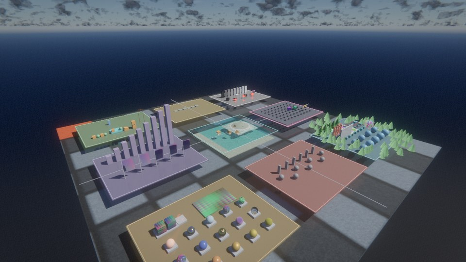
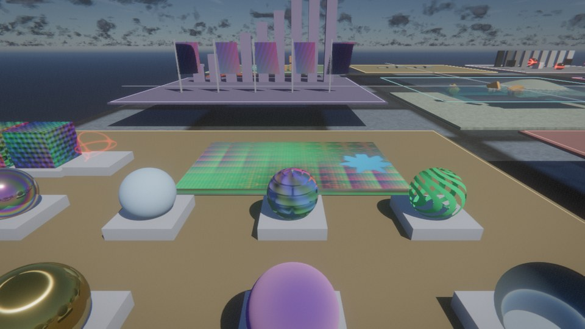
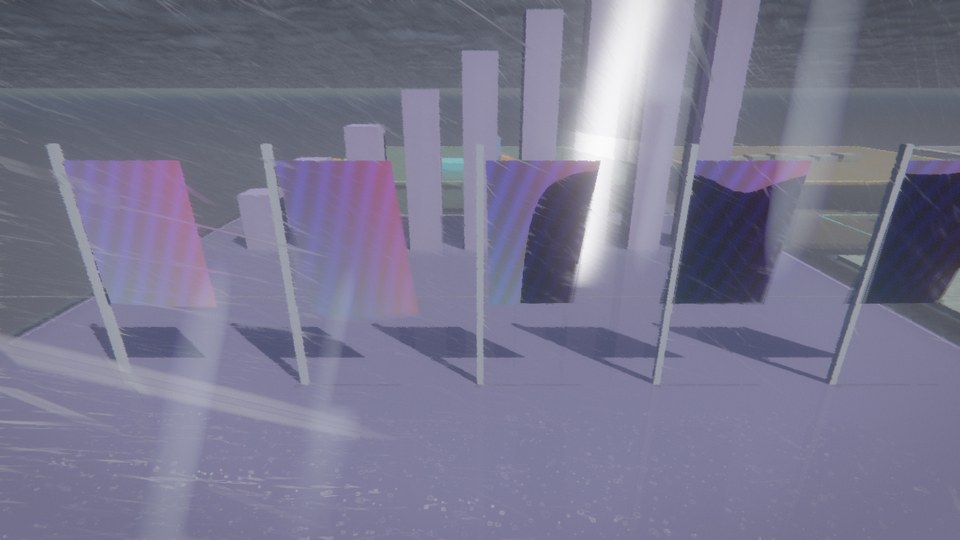
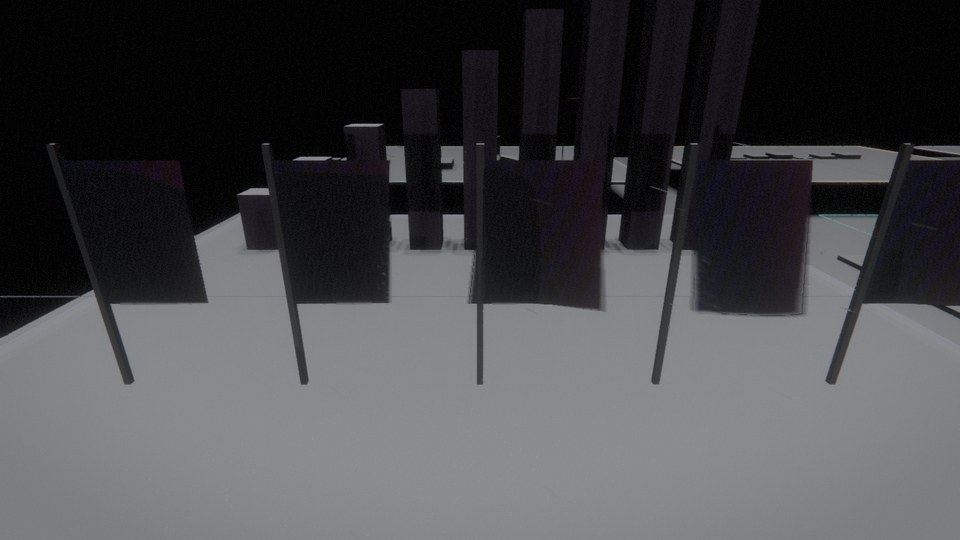
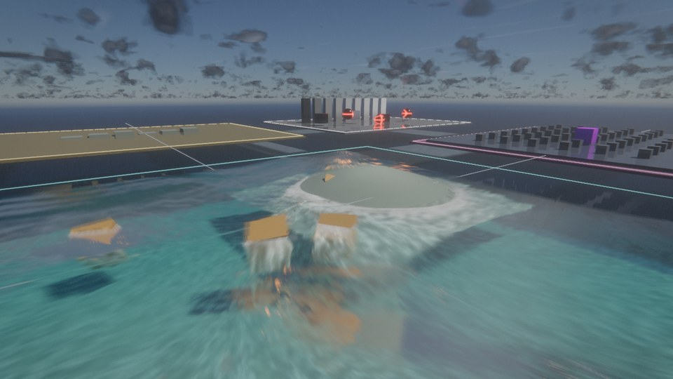
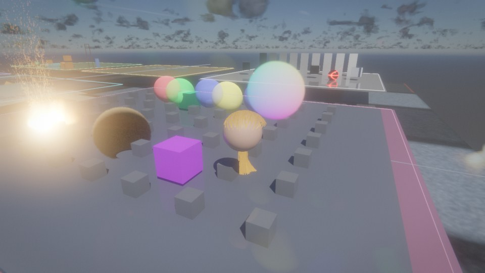
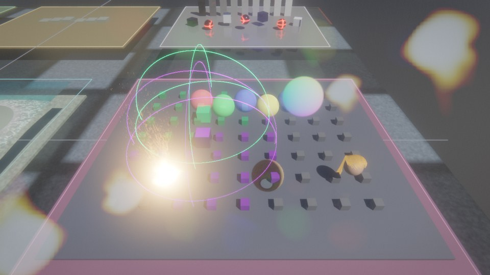

# RX Feature Gym

`--demo featuregym` is a self-contained acceptance world for RX. All geometry is
procedural and all texture/audio inputs are generated by `generate_assets.py`;
the gym has no game-data or downloaded-asset dependency.

The nine districts cover materials, local lighting, geometry scalability,
atmosphere/weather, water, special effects, physics, animation, and temporal/post
processing. Hardware-dependent features remain enabled through RX's normal
capability fallbacks, so the same world starts on raster-only and RT-capable GPUs.
Interactive districts preserve explicit `--no-taa` and `--upscaler` choices; the
deterministic tour selects its own modes where a stop is testing one of them.
The lighting tour includes RCGI; launch with `--no-rt` or `RX_RCGI_SW=1` to run
that stop through the software SDF tracer instead of hardware ray queries.

The 31-stop tour also exercises streamed instance-group replacement, split PBR
maps with per-submesh materials, eight-layer terrain splatting, projected virtual
geometry albedo, Gerstner shoreline buoyancy, Jolt strand grooming, local network
interest bubbles, and ECS camera-stack transitions. The weather stops cover
volumetric rain and snow, storm lightning, surface response, and aurora. Strand
dynamics fall back to the authored groom when Jolt is unavailable.

Three vehicle stops drive the physics stack directly: a car laps a flat asphalt
oval on its own heightfield south of the physics district, a force-simulated
motorboat (hull buoyancy, propeller, rudder) runs a circuit on the water-district
lake and lays down a wake, and a fixed-wing aircraft (strip-theory aero, prop,
landing gear) is flung off the apron and banks around a circle at altitude over
the circuit. All three fall back to static props without Jolt.

Regenerate the binary inputs after changing the generator:

```sh
python3 runtime/feature_gym/generate_assets.py
```

CMake copies these assets beside the viewer binary and the Nix package includes
the same sidecar directory. Set `RX_FEATURE_GYM_ASSET_DIR` to override the lookup
root.

Run the deterministic camera pass and capture every stop:

```sh
RX_FIXED_DT=0.016666667 RX_SHOWCASE=1 \
  RX_SHOWCASE_SHOTS=build/feature-gym-shots RX_SHOWCASE_QUIT=1 \
  build/linux/runtime/rx --demo featuregym
```

`tests/feature_gym/tour.py` wraps that command and rejects missing, black, or
uniform captures.

## Captures














